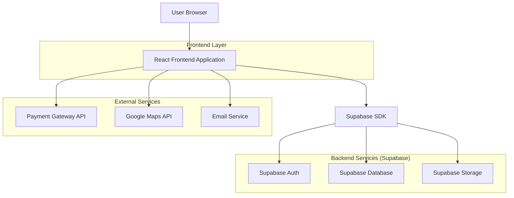
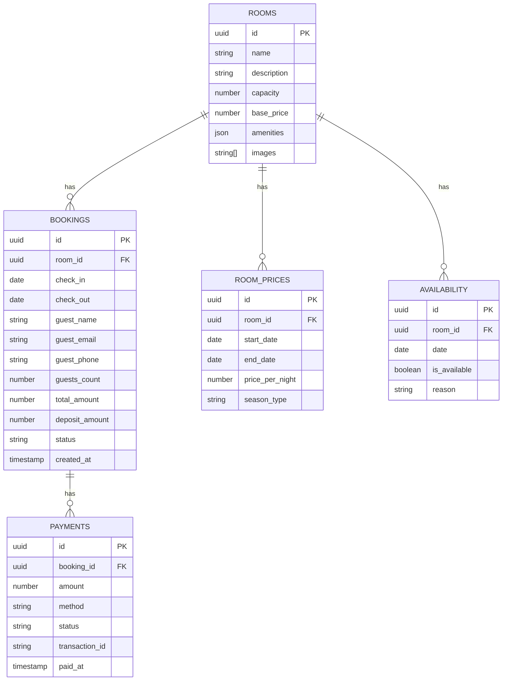

## 1. Architecture design



## 2. Technology Description

* **Frontend**: React\@18 + tailwindcss\@3 + vite

* **Initialization Tool**: vite-init

* **Backend**: Supabase (Auth, Database, Storage)

* **Payment Integration**: Przelewy24/PayU API

* **Email Service**: Supabase Edge Functions + SendGrid

* **Maps Integration**: Google Maps JavaScript API

## 3. Route definitions

| Route           | Cel                                                                        |
| --------------- | -------------------------------------------------------------------------- |
| /               | Strona główna z hero section, widgetem rezerwacyjnym i prezentacją obiektu |
| /rooms          | Lista wszystkich pokoi z filtrami i wyszukiwaniem                          |
| /room/:id       | Szczegóły konkretnego pokoju z galerią i kalendarzem dostępności           |
| /booking        | Proces rezerwacji - wybór terminu, dane gościa, podsumowanie               |
| /payment        | Strona płatności z integracją bramki płatniczej                            |
| /confirmation   | Potwierdzenie rezerwacji z numerem rezerwacji                              |
| /admin          | Panel administracyjny - dashboard                                          |
| /admin/bookings | Zarządzanie rezerwacjami                                                   |
| /admin/rooms    | Zarządzanie pokojami i cenami                                              |
| /admin/calendar | Kalendarz dostępności wszystkich pokoi                                     |
| /admin/settings | Ustawienia systemu i integracje                                            |

## 4. API definitions

### 4.1 Booking API

**Utworzenie rezerwacji**

```
POST /api/bookings
```

Request:

| Parametr      | Typ    | Wymagany | Opis                   |
| ------------- | ------ | -------- | ---------------------- |
| room\_id      | string | true     | ID pokoju              |
| check\_in     | date   | true     | Data zameldowania      |
| check\_out    | date   | true     | Data wymeldowania      |
| guest\_name   | string | true     | Imię i nazwisko gościa |
| guest\_email  | string | true     | Email gościa           |
| guest\_phone  | string | true     | Telefon gościa         |
| guests\_count | number | true     | Liczba gości           |

Response:

| Parametr        | Typ    | Opis                       |
| --------------- | ------ | -------------------------- |
| booking\_id     | string | Unikalny numer rezerwacji  |
| total\_amount   | number | Całkowita kwota do zapłaty |
| deposit\_amount | number | Kwota zaliczki (30%)       |
| payment\_url    | string | URL do płatności           |

### 4.2 Availability API

**Sprawdzenie dostępności**

```
GET /api/availability/:room_id
```

Query params:

| Parametr   | Typ  | Wymagany | Opis              |
| ---------- | ---- | -------- | ----------------- |
| check\_in  | date | true     | Data zameldowania |
| check\_out | date | true     | Data wymeldowania |

Response:

| Parametr          | Typ     | Opis                    |
| ----------------- | ------- | ----------------------- |
| available         | boolean | Czy pokój jest dostępny |
| price\_per\_night | number  | Cena za noc             |
| total\_price      | number  | Całkowita cena za pobyt |

### 4.3 Payment API

**Inicjalizacja płatności**

```
POST /api/payments/init
```

Request:

| Parametr        | Typ    | Wymagany | Opis                                    |
| --------------- | ------ | -------- | --------------------------------------- |
| booking\_id     | string | true     | ID rezerwacji                           |
| amount          | number | true     | Kwota do zapłaty                        |
| payment\_method | string | true     | Metoda płatności (blik, transfer, card) |

Response:

| Parametr      | Typ    | Opis                         |
| ------------- | ------ | ---------------------------- |
| payment\_id   | string | ID płatności                 |
| redirect\_url | string | URL przekierowania do bramki |

## 5. Data model

### 5.1 Data model definition



### 5.2 Data Definition Language

**Tabela pokoi (rooms)**

```sql
CREATE TABLE rooms (
  id UUID PRIMARY KEY DEFAULT gen_random_uuid(),
  name VARCHAR(100) NOT NULL,
  description TEXT,
  capacity INTEGER NOT NULL,
  base_price DECIMAL(10,2) NOT NULL,
  amenities JSONB DEFAULT '[]',
  images TEXT[] DEFAULT '{}',
  created_at TIMESTAMP WITH TIME ZONE DEFAULT NOW(),
  updated_at TIMESTAMP WITH TIME ZONE DEFAULT NOW()
);

-- Uprawnienia
GRANT SELECT ON rooms TO anon;
GRANT ALL PRIVILEGES ON rooms TO authenticated;
```

**Tabela rezerwacji (bookings)**

```sql
CREATE TABLE bookings (
  id UUID PRIMARY KEY DEFAULT gen_random_uuid(),
  room_id UUID REFERENCES rooms(id) ON DELETE CASCADE,
  check_in DATE NOT NULL,
  check_out DATE NOT NULL,
  guest_name VARCHAR(100) NOT NULL,
  guest_email VARCHAR(255) NOT NULL,
  guest_phone VARCHAR(20) NOT NULL,
  guests_count INTEGER NOT NULL,
  total_amount DECIMAL(10,2) NOT NULL,
  deposit_amount DECIMAL(10,2) NOT NULL,
  status VARCHAR(20) DEFAULT 'pending' CHECK (status IN ('pending', 'confirmed', 'cancelled', 'completed')),
  created_at TIMESTAMP WITH TIME ZONE DEFAULT NOW(),
  updated_at TIMESTAMP WITH TIME ZONE DEFAULT NOW()
);

-- Indeksy
CREATE INDEX idx_bookings_room_id ON bookings(room_id);
CREATE INDEX idx_bookings_dates ON bookings(check_in, check_out);
CREATE INDEX idx_bookings_email ON bookings(guest_email);

-- Uprawnienia
GRANT SELECT ON bookings TO anon;
GRANT ALL PRIVILEGES ON bookings TO authenticated;
```

**Tabela płatności (payments)**

```sql
CREATE TABLE payments (
  id UUID PRIMARY KEY DEFAULT gen_random_uuid(),
  booking_id UUID REFERENCES bookings(id) ON DELETE CASCADE,
  amount DECIMAL(10,2) NOT NULL,
  method VARCHAR(20) NOT NULL CHECK (method IN ('blik', 'transfer', 'card')),
  status VARCHAR(20) DEFAULT 'pending' CHECK (status IN ('pending', 'completed', 'failed', 'refunded')),
  transaction_id VARCHAR(100),
  paid_at TIMESTAMP WITH TIME ZONE,
  created_at TIMESTAMP WITH TIME ZONE DEFAULT NOW()
);

-- Uprawnienia
GRANT SELECT ON payments TO anon;
GRANT ALL PRIVILEGES ON payments TO authenticated;
```

**Tabela cen sezonowych (room\_prices)**

```sql
CREATE TABLE room_prices (
  id UUID PRIMARY KEY DEFAULT gen_random_uuid(),
  room_id UUID REFERENCES rooms(id) ON DELETE CASCADE,
  start_date DATE NOT NULL,
  end_date DATE NOT NULL,
  price_per_night DECIMAL(10,2) NOT NULL,
  season_type VARCHAR(20) CHECK (season_type IN ('low', 'medium', 'high', 'premium')),
  created_at TIMESTAMP WITH TIME ZONE DEFAULT NOW()
);

CREATE INDEX idx_room_prices_room_dates ON room_prices(room_id, start_date, end_date);

-- Uprawnienia
GRANT SELECT ON room_prices TO anon;
GRANT ALL PRIVILEGES ON room_prices TO authenticated;
```

**Tabela dostępności (availability)**

```sql
CREATE TABLE availability (
  id UUID PRIMARY KEY DEFAULT gen_random_uuid(),
  room_id UUID REFERENCES rooms(id) ON DELETE CASCADE,
  date DATE NOT NULL,
  is_available BOOLEAN DEFAULT true,
  reason VARCHAR(100),
  created_at TIMESTAMP WITH TIME ZONE DEFAULT NOW(),
  UNIQUE(room_id, date)
);

CREATE INDEX idx_availability_room_date ON availability(room_id, date);

-- Uprawnienia
GRANT SELECT ON availability TO anon;
GRANT ALL PRIVILEGES ON availability TO authenticated;
```

