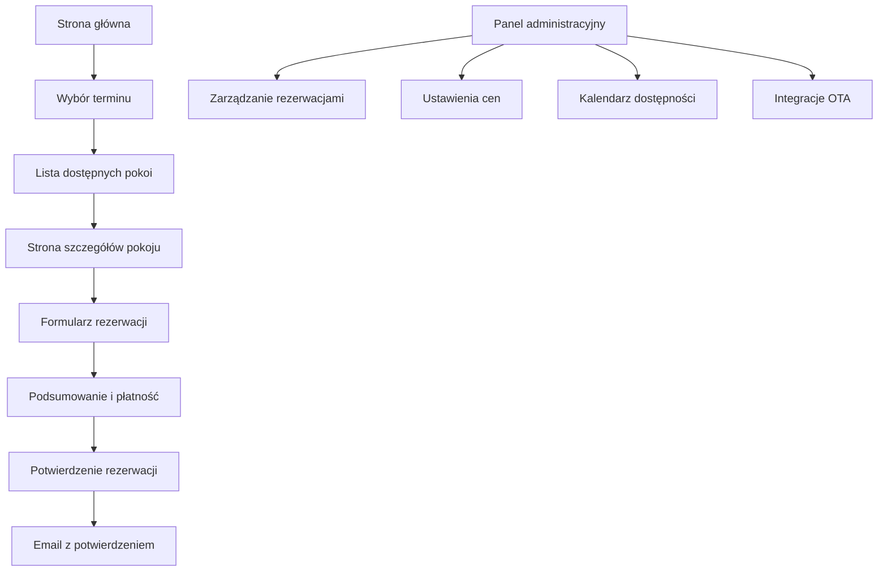

## 1. Product Overview
Willa Zielona to nowoczesny obiekt noclegowy w centrum Zakopanego oferujący komfortowe pokoje z zielonym ogrodem. System rezerwacji online umożliwia klientom samodzielną rezerwację pokoi z płatnością online, eliminując potrzebę kontaktu telefonicznego.

Celem jest stworzenie niezależnego kanału sprzedaży bezpośredniej, który zwiększy obłożenie i zyski obiektu poprzez automatyzację procesu rezerwacji.

## 2. Core Features

### 2.1 User Roles
| Rola | Metoda rejestracji | Podstawowe uprawnienia |
|------|-------------------|------------------------|
| Gość | Rejestracja podczas rezerwacji (email) | Przeglądanie oferty, dokonywanie rezerwacji, płatność online |
| Administrator | Panel administracyjny | Zarządzanie rezerwacjami, cenami, dostępnością, konfiguracja systemu |

### 2.2 Feature Module
System rezerwacji Willa Zielona składa się z następujących głównych stron:
1. **Strona główna**: sekcja hero z widgetem rezerwacyjnym, prezentacja atutów, galeria pokoi, opinie gości.
2. **Strona pokoju**: szczegóły pokoju, zdjęcia, cennik, kalendarz dostępności, przycisk rezerwacji.
3. **Proces rezerwacji**: wybór terminu, dane gościa, podsumowanie, płatność online, potwierdzenie.
4. **Panel administracyjny**: zarządzanie rezerwacjami, ustawienia cen, kalendarz dostępności, raporty.

### 2.3 Page Details
| Nazwa strony | Moduł | Opis funkcjonalności |
|--------------|--------|------------------------|
| Strona główna | Hero section | Wyświetla zdjęcie obiektu z nakładką widgetu rezerwacyjnego (data zameldowania/wymeldowania, liczba gości, przycisk "Szukaj") |
| Strona główna | Nawigacja | Przejrzyste menu z linkami: O nas, Pokoje, Galeria, Okolica, Kontakt oraz wyróżniony przycisk "Rezerwuj online" |
| Strona główna | Atuty | Ikony prezentujące zalety: lokalizacja, Wi-Fi, komfortowe pokoje |
| Strona główna | Pokoje | Kafelki z podglądem pokoi, zdjęciem, krótkim opisem i przyciskiem "Wybierz termin" |
| Strona główna | Opinie | Widget wyświetlający opinie z Google Maps (ocena 4.1) z możliwością filtrowania najlepszych |
| Strona pokoju | Galeria | Karuzela zdjęć pokoju z możliwością powiększenia |
| Strona pokoju | Opis | Szczegółowy opis pokoju, udogodnienia, metraż |
| Strona pokoju | Cennik | Dynamiczny cennik pokazujący ceny w zależności od sezonu i długości pobytu |
| Strona pokoju | Kalendarz | Interaktywny kalendarz pokazujący dostępność pokoju w czasie rzeczywistym |
| Proces rezerwacji | Wybór terminu | Kalendarz z blokadą zajętych terminów, automatyczne wyliczenie ceny |
| Proces rezerwacji | Dane gościa | Formularz z imieniem, nazwiskiem, emailem, telefonem, liczbą gości |
| Proces rezerwacji | Podsumowanie | Wyświetlenie szczegółów rezerwacji, ceny, zaliczki (30%), polityki anulacji |
| Proces rezerwacji | Płatność | Integracja z bramką płatności (Przelewy24/PayU), obsługa BLIK, szybkich przelewów, kart |
| Proces rezerwacji | Potwierdzenie | Wyświetlenie potwierdzenia z numerem rezerwacji, wysłanie emaila z potwierdzeniem |
| Panel admin | Dashboard | Przegląd rezerwacji, statystyki obłożenia, przychody |
| Panel admin | Zarządzanie rezerwacjami | Lista rezerwacji z filtrami, możliwość edycji, anulowania |
| Panel admin | Cennik | Ustawianie cen sezonowych, rabatów za długi pobyt, promocji |
| Panel admin | Kalendarz | Widok dostępności wszystkich pokoi, blokowanie terminów |
| Panel admin | Ustawienia | Konfiguracja zaliczki, polityki anulacji, integracji OTA, szablony emaili |

## 3. Core Process
**Flow gościa**: Użytkownik wchodzi na stronę → w sekcji hero wybiera daty i liczbę gości → klika "Szukaj" → system pokazuje dostępne pokoje → użytkownik wybiera pokój → przechodzi do szczegółów pokoju → klika "Rezerwuj" → wypełnia formularz z danymi → system oblicza cenę i zaliczkę → użytkownik dokonuje płatności online → otrzymuje potwierdzenie email.

**Flow administratora**: Loguje się do panelu admin → przegląda rezerwacje → aktualizuje dostępność → ustawia ceny sezonowe → konfiguruje integracje OTA → monitoruje statystyki.

## 4. User Interface Design

### 4.1 Design Style
- **Kolorystyka**: Biały (#FFFFFF) jako kolor podstawowy, jasne szarości (#F8F9FA, #E9ECEF) dla tła, zieleń szałwiowa (#6B8E23) i butelkowa (#228B22) dla akcentów i CTA
- **Przyciski**: Zaokrąglone rogi (border-radius: 8px), zielone przyciski CTA z białym tekstem, efekt hover z ciemniejszym odcieniem
- **Czcionki**: Inter lub Poppins dla nagłówków (font-size: 32px, 24px, 18px), Open Sans dla treści (16px, 14px)
- **Layout**: Card-based design z cieniami (box-shadow: 0 2px 10px rgba(0,0,0,0.1)), top navigation sticky
- **Ikony**: Minimalistyczne ikony line-style z biblioteki React Icons lub Feather Icons

### 4.2 Page Design Overview
| Nazwa strony | Moduł | Elementy UI |
|--------------|--------|-------------|
| Strona główna | Hero section | Pełnoekranowe zdjęcie z overlayem, widget rezerwacyjny jako białe kafelko z cieniem, zielony przycisk "Szukaj" |
| Strona główna | Nawigacja | Białe tło z cieniem, logo po lewej, menu wyśrodkowane, zielony przycisk CTA po prawej |
| Strona główna | Atuty | Ikony w kolorze zielonym, tekst szary, układ 3 kolumn w desktop, 1 kolumna w mobile |
| Strona główna | Pokoje | Kafelki z zaokrąglonymi rogami, zdjęcie 16:9, cena wyróżniona kolorem zielonym |
| Strona pokoju | Galeria | Karuzela z miniaturkami, możliwość powiększenia w lightboxie |
| Strona pokoju | Kalendarz | Kalendarz miesięczny, zielone oznaczenie dostępnych dni, szare zajęte |
| Proces rezerwacji | Formularz | Białe pola input z zieloną ramką przy focus, walidacja w czasie rzeczywistym |
| Proces rezerwacji | Płatność | Wybór metody płatności z ikonami, bezpieczny iframe z bramki płatności |

### 4.3 Responsiveness
Desktop-first approach z responsywnymi breakpointami: desktop (1200px+), tablet (768px-1199px), mobile (320px-767px). Sticky bar z przyciskiem rezerwacji widoczny tylko na urządzeniach mobilnych. Touch-friendly przyciski min. 44px wysokości.